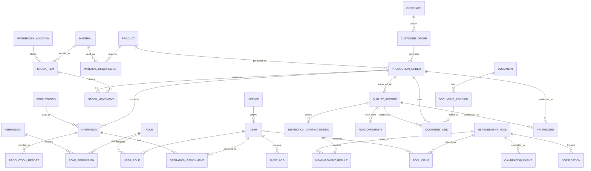

# LightSuite ERP — Data Model v0.1

## Status

Initial conceptual data model for the LightSuite ERP case study.

This is not yet a final database schema. It is the first structured version of the domain model, designed to show how manufacturing data could be organized before implementation.

## Data model goal

The goal of the data model is to connect the real manufacturing flow:

```text
customer order → production order → material movement → operation → inspection → documentation → analytics
```

The model should support traceability without becoming too heavy for users.

## Design principles

### 1. Traceability first

A user should be able to follow the story of an order, material, inspection record, document revision or measurement tool.

### 2. Relational structure

The system should use a relational database because manufacturing data is naturally connected: orders have operations, operations use materials, inspections refer to production, and tools have calibration history.

### 3. Role-aware data

The data model must support role-based permissions. Users, roles and audit logs are part of the foundation, not an afterthought.

### 4. Controlled documentation

Documents and revisions must be modeled explicitly because current instructions and drawings are critical in production and quality.

### 5. Calibration as a workflow

Measurement tools are not just assets. They move between locations, operators and production areas, and they have calibration due dates.

## Core entity groups

| Group | Entities | Purpose |
|---|---|---|
| Identity and access | User, Role, Permission, UserRole, AuditLog | Users, access control and traceability of sensitive changes. |
| Master data | Customer, Supplier, Product, Material | Core business objects used across orders, warehouse and production. |
| Production | CustomerOrder, ProductionOrder, Operation, Workstation, ProductionReport | Production planning, execution and reporting. |
| Warehouse | WarehouseLocation, StockItem, StockMovement | Material availability, locations and stock traceability. |
| Quality | QualityRecord, InspectionCharacteristic, MeasurementResult, Nonconformity | Inspection, measurement and quality history. |
| Documentation | Document, DocumentRevision, DocumentLink | Controlled instructions, drawings and revision links. |
| Tooling and calibration | MeasurementTool, ToolIssue, CalibrationEvent | Measurement tool ownership, usage and calibration due dates. |
| Analytics and system | KPIRecord, Notification, License | Reporting snapshots, reminders and license state. |

## Entity relationship diagram



## Core entities v0.1

### User

Represents a person using the system.

Suggested fields:

| Field | Purpose |
|---|---|
| id | Primary identifier. |
| name | Display name. |
| email | Login and contact identity. |
| password_hash | Secure password storage. |
| status | Active, inactive, locked. |
| created_at | Creation timestamp. |
| updated_at | Last update timestamp. |

### Role

Represents a responsibility group such as Operator, Leader, Quality User or Administrator.

Suggested fields:

| Field | Purpose |
|---|---|
| id | Primary identifier. |
| name | Role name. |
| description | Human-readable explanation. |
| is_system_role | Protects default roles from accidental deletion. |

### Permission

Represents a specific action or access rule.

Examples:

- production.order.create
- production.report.create
- warehouse.stock.view
- quality.record.approve
- document.revision.approve
- tooling.calibration.update
- admin.user.manage

### Customer

Represents a customer placing orders.

Suggested fields:

| Field | Purpose |
|---|---|
| id | Primary identifier. |
| name | Customer name. |
| customer_code | Internal code. |
| status | Active / inactive. |

### Product

Represents a produced item.

Suggested fields:

| Field | Purpose |
|---|---|
| id | Primary identifier. |
| sku | Product code. |
| name | Product name. |
| revision | Product revision. |
| default_document_id | Optional link to controlled documentation. |

### Material

Represents raw material, component or consumable.

Suggested fields:

| Field | Purpose |
|---|---|
| id | Primary identifier. |
| material_code | Internal material code. |
| ean_code | Optional EAN identifier. |
| qr_code | Optional QR identifier. |
| name | Material name. |
| unit | Unit of measure. |

### CustomerOrder

Represents the commercial or planning source of production demand.

Suggested fields:

| Field | Purpose |
|---|---|
| id | Primary identifier. |
| customer_id | Customer reference. |
| order_number | External or internal order number. |
| status | Draft, confirmed, in progress, completed, cancelled. |
| due_date | Expected delivery date. |

### ProductionOrder

Represents a manufacturing order.

Suggested fields:

| Field | Purpose |
|---|---|
| id | Primary identifier. |
| customer_order_id | Optional customer order reference. |
| product_id | Product being produced. |
| order_number | Internal production order number. |
| quantity_planned | Planned quantity. |
| quantity_completed | Completed quantity. |
| status | Planned, released, in progress, on hold, completed. |
| priority | Planning priority. |

### Operation

Represents one production step.

Suggested fields:

| Field | Purpose |
|---|---|
| id | Primary identifier. |
| production_order_id | Parent production order. |
| workstation_id | Where the operation is performed. |
| sequence_number | Operation order. |
| name | Operation name. |
| status | Planned, active, paused, completed. |
| planned_time_minutes | Expected duration. |
| actual_time_minutes | Reported duration. |

### ProductionReport

Represents an operator or leader report from production.

Suggested fields:

| Field | Purpose |
|---|---|
| id | Primary identifier. |
| operation_id | Related operation. |
| user_id | Reporting user. |
| quantity_ok | Accepted quantity. |
| quantity_nok | Rejected quantity. |
| notes | Issue or progress notes. |
| reported_at | Report timestamp. |

### WarehouseLocation

Represents a physical storage location.

Suggested fields:

| Field | Purpose |
|---|---|
| id | Primary identifier. |
| code | Location code. |
| name | Location name. |
| type | Warehouse, production buffer, quarantine, tool room. |
| qr_code | Optional scannable identifier. |

### StockItem

Represents material quantity in a location.

Suggested fields:

| Field | Purpose |
|---|---|
| id | Primary identifier. |
| material_id | Material reference. |
| location_id | Warehouse location. |
| lot_number | Lot or batch number. |
| quantity | Current quantity. |
| status | Available, reserved, quarantined, consumed. |

### StockMovement

Represents material movement.

Suggested fields:

| Field | Purpose |
|---|---|
| id | Primary identifier. |
| stock_item_id | Stock item reference. |
| production_order_id | Optional production order reference. |
| movement_type | Receipt, issue, transfer, correction, return. |
| quantity | Movement quantity. |
| from_location_id | Source location. |
| to_location_id | Target location. |
| created_by | User who created movement. |
| created_at | Timestamp. |

### QualityRecord

Represents an inspection or quality check.

Suggested fields:

| Field | Purpose |
|---|---|
| id | Primary identifier. |
| production_order_id | Related production order. |
| operation_id | Optional operation reference. |
| inspector_id | Quality user. |
| status | Draft, in review, approved, rejected. |
| result | Pass, fail, conditional. |
| created_at | Creation timestamp. |
| approved_at | Approval timestamp. |

### InspectionCharacteristic

Represents what must be checked.

Suggested fields:

| Field | Purpose |
|---|---|
| id | Primary identifier. |
| quality_record_id | Parent quality record. |
| name | Characteristic name. |
| nominal_value | Target value. |
| lower_tolerance | Lower tolerance. |
| upper_tolerance | Upper tolerance. |
| unit | Measurement unit. |
| method | Inspection method. |

### MeasurementResult

Represents a measured value.

Suggested fields:

| Field | Purpose |
|---|---|
| id | Primary identifier. |
| characteristic_id | Related characteristic. |
| measurement_tool_id | Tool used. |
| measured_value | Result value. |
| result_status | OK / NOK. |
| measured_by | User who measured. |
| measured_at | Timestamp. |

### Nonconformity

Represents a quality issue or deviation.

Suggested fields:

| Field | Purpose |
|---|---|
| id | Primary identifier. |
| quality_record_id | Related quality record. |
| severity | Minor, major, critical. |
| description | What happened. |
| disposition | Rework, scrap, use as is, hold. |
| status | Open, under review, closed. |

### Document

Represents a controlled document group.

Suggested fields:

| Field | Purpose |
|---|---|
| id | Primary identifier. |
| document_number | Controlled document number. |
| title | Document title. |
| document_type | Drawing, work instruction, regulation, form. |
| owner_id | Responsible user. |
| status | Active, archived, obsolete. |

### DocumentRevision

Represents a specific version of a controlled document.

Suggested fields:

| Field | Purpose |
|---|---|
| id | Primary identifier. |
| document_id | Parent document. |
| revision | Revision code. |
| file_path | File location or storage key. |
| approved_by | Approving user. |
| approved_at | Approval timestamp. |
| valid_from | Effective date. |

### MeasurementTool

Represents a measurement tool or gauge.

Suggested fields:

| Field | Purpose |
|---|---|
| id | Primary identifier. |
| tool_code | Internal tool number. |
| qr_code | Optional scannable identifier. |
| name | Tool name. |
| type | Caliper, micrometer, gauge, fixture, CMM-related, other. |
| status | Available, issued, calibration due, blocked, retired. |
| current_location_id | Current location. |
| calibration_due_date | Next calibration due date. |

### ToolIssue

Represents issuing a tool to production or operator.

Suggested fields:

| Field | Purpose |
|---|---|
| id | Primary identifier. |
| measurement_tool_id | Tool reference. |
| issued_to_user_id | Operator or responsible user. |
| production_order_id | Optional production order reference. |
| issued_at | Issue timestamp. |
| returned_at | Return timestamp. |
| status | Issued, returned, overdue, lost. |

### CalibrationEvent

Represents calibration history.

Suggested fields:

| Field | Purpose |
|---|---|
| id | Primary identifier. |
| measurement_tool_id | Tool reference. |
| calibration_date | Calibration date. |
| next_due_date | Next due date. |
| result | Passed, failed, adjusted, blocked. |
| certificate_reference | Certificate number or file reference. |
| performed_by | User or external provider. |

### AuditLog

Represents sensitive system changes.

Suggested fields:

| Field | Purpose |
|---|---|
| id | Primary identifier. |
| user_id | User performing action. |
| entity_type | Changed entity type. |
| entity_id | Changed entity ID. |
| action | Create, update, delete, approve, login, export. |
| old_value | Optional previous state. |
| new_value | Optional new state. |
| created_at | Timestamp. |

## Important relationships

| Relationship | Meaning |
|---|---|
| Customer → CustomerOrder | A customer can place many orders. |
| CustomerOrder → ProductionOrder | One customer order can generate one or more production orders. |
| Product → ProductionOrder | A production order produces a defined product. |
| ProductionOrder → Operation | Each production order contains ordered operations. |
| Operation → ProductionReport | Reports capture progress and issues for an operation. |
| Material → StockItem | Material can exist in multiple locations and lots. |
| StockItem → StockMovement | Every stock movement creates traceability. |
| ProductionOrder → QualityRecord | Quality checks are linked to production context. |
| QualityRecord → MeasurementResult | Measurement results belong to inspection records. |
| MeasurementTool → MeasurementResult | A result should know which tool was used. |
| MeasurementTool → CalibrationEvent | Calibration history stays connected to the tool. |
| Document → DocumentRevision | Controlled documents have version history. |
| DocumentRevision → DocumentLink | Specific revisions can be linked to production or quality records. |
| User → AuditLog | Sensitive changes are traceable to a user. |

## First implementation priorities

For an MVP, the model should start with a smaller set:

1. User / Role / Permission
2. Product / Material
3. ProductionOrder / Operation / ProductionReport
4. WarehouseLocation / StockItem / StockMovement
5. QualityRecord / MeasurementResult
6. MeasurementTool / CalibrationEvent
7. Document / DocumentRevision
8. AuditLog

## Open design questions

- Should customer orders be part of MVP or added later?
- Should stock reservations be modeled separately from stock movements?
- Should quality approvals require two users?
- Should calibration events support external providers as a separate entity?
- Should document files be stored locally, in object storage or only referenced by path?
- Should measurement results support repeated measurements and statistical groups for MSA?

## Next step

The next step is to turn this conceptual model into a first technical schema draft.

Possible deliverables:

- SQL table draft,
- Prisma schema draft,
- REST API endpoint list,
- validation rules for core entities,
- sample demo data.
