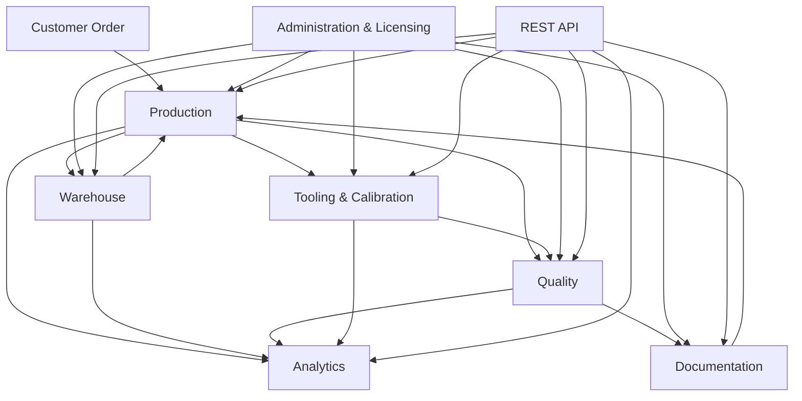

# LightSuite ERP — Module Map

## Purpose

This document shows how the main LightSuite ERP modules relate to each other.

The goal is to make the system understandable before implementation. A manufacturing system should not begin with screens or database tables only. It should begin with the flow of work and information.

## High-level module map



## Main modules

### Production

The production module is the operational center of the system.

It manages production orders, operations, workstations, operator assignments, progress reporting and production-related issues.

It connects directly with:

- warehouse, because production needs materials,
- documentation, because operators need current instructions and drawings,
- quality, because output needs inspection and traceability,
- tooling and calibration, because measurement tools must be valid,
- analytics, because production data becomes performance information.

### Warehouse

The warehouse module manages material receipts, internal issues, stock locations, EAN / QR support and movement history.

It should answer simple but important questions:

- Is the material available?
- Where is it located?
- Was it issued to production?
- Which order used it?
- Can the material movement be traced later?

### Quality

The quality module collects inspection records, measurement results, nonconformity notes, MSA-related data and Cg / Cgk calculations.

It should not work as a separate island. Quality records should stay connected with production orders, drawings, tools, operators and documentation revisions.

### Documentation

The documentation module manages work instructions, technical drawings, controlled documents and revision history.

This module is important because one outdated document can create repeated mistakes across production and quality.

### Tooling and calibration

The tooling and calibration module tracks measurement tools, their locations, operator assignments, usage history and calibration due dates.

It connects production reality with metrology discipline.

### Analytics

The analytics module turns operational data into useful visibility.

It should support questions such as:

- Where are delays happening?
- Which quality issues repeat?
- Which tools are close to calibration due date?
- Which operations generate the most problems?
- Which areas need attention from a leader?

### REST API

The REST API allows LightSuite ERP to be integrated with other tools, future modules, dashboards or automation scripts.

The API should be documented from the beginning because integration becomes easier when data boundaries are clear.

### Administration and licensing

This module manages users, roles, permissions, system settings and license validation.

In a real system, access control matters because not every user should be able to change master data, quality records or licensing settings.

## Information flow principle

The modules are separate for clarity, but the information should not be trapped inside them.

A good manufacturing system should allow a user to follow the story of an order:

```text
material → production → inspection → documentation → reporting → improvement
```

That traceability is the real value of the system.
