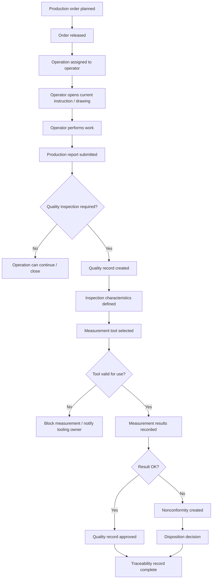

# LightSuite ERP — Production to Quality Workflow

## Purpose

This workflow describes how a production order moves from planned work into quality inspection and traceability records.

The goal is to show that LightSuite ERP is not only a set of modules. It is a connected manufacturing flow where production output, inspection records, measurement tools, documents and decisions stay linked.

## Workflow question

> How does the system connect what was produced with how it was inspected, which document revision was used and which measurement tool supported the decision?

## Actors involved

| Actor | Responsibility |
|---|---|
| Leader / Supervisor | Releases production order, assigns operations and monitors progress. |
| Operator | Performs assigned operation and reports production result. |
| Quality User | Creates inspection record, records measurements and approves or rejects result. |
| Document Controller | Maintains controlled instructions and drawings. |
| Tooling / Calibration Owner | Maintains measurement tool validity and calibration status. |

## High-level flow

## Step-by-step workflow

### 1. Production order is planned

The leader creates or reviews a production order connected to a product, quantity and planned dates.

The order should already have:

- product reference,
- planned quantity,
- required operations,
- linked documents or product documentation,
- material requirement context.

### 2. Production order is released

The leader releases the order when it is ready for execution.

Release should only happen when basic conditions are met:

- product exists,
- required documents are available,
- material status is known,
- operations are defined,
- responsible workstation or area is identified.

### 3. Operation is assigned

An operation is assigned to an operator or team.

The operator should see only what is relevant:

- operation name,
- production order,
- workstation,
- planned quantity,
- current instruction,
- notes or warnings,
- reporting action.

### 4. Operator performs work

The operator performs the operation using the current controlled instruction or drawing.

This is where documentation control matters. If an outdated document is used, the quality record becomes weaker.

### 5. Production report is submitted

The operator reports:

- quantity OK,
- quantity NOK,
- issue notes,
- time or progress information,
- optional deviation comment.

This creates the bridge between production execution and quality decision-making.

### 6. Quality inspection is triggered

Inspection may be triggered by:

- operation type,
- product requirements,
- first article requirement,
- reported issue,
- quality plan,
- leader or quality decision.

### 7. Quality record is created

A quality user creates an inspection record linked to:

- production order,
- operation,
- product,
- inspector,
- document revision,
- measurement tool if used.

### 8. Inspection characteristics are checked

Inspection characteristics define what must be verified.

Examples:

- dimension,
- tolerance,
- visual requirement,
- functional requirement,
- document revision check,
- measurement method.

### 9. Measurement tool validity is checked

Before recording a measurement result, the system should check whether the selected tool is valid.

The tool should not be blocked, retired or past calibration due date.

If the tool is not valid, the system should prevent or clearly flag the measurement.

### 10. Measurement results are recorded

The quality user records measurement values and result status.

Each result should preserve context:

- characteristic,
- measured value,
- measuring user,
- timestamp,
- tool used,
- status OK / NOK.

### 11. Quality decision is made

The quality record can be:

- approved,
- rejected,
- kept in review,
- linked to nonconformity.

Approval should be audit-sensitive because it affects traceability and production release.

### 12. Nonconformity is handled if needed

If the result is not acceptable, a nonconformity is created.

It should include:

- severity,
- description,
- affected production order,
- related quality record,
- disposition decision,
- status.

## Key data created

| Step | Data created or updated |
|---|---|
| Order release | ProductionOrder status update |
| Assignment | OperationAssignment |
| Reporting | ProductionReport |
| Inspection start | QualityRecord |
| Characteristic setup | InspectionCharacteristic |
| Measurement | MeasurementResult |
| Approval | QualityRecord status and approval timestamp |
| Issue handling | Nonconformity |
| Traceability | DocumentLink, AuditLog |

## Validation rules

- A production order cannot be released without at least one operation.
- A production report cannot have negative OK or NOK quantity.
- A quality record must reference a production order.
- A measurement result should reference a valid inspection characteristic.
- If a measurement tool is used, it must not be blocked or overdue for calibration.
- A quality approval should require the correct permission.
- Approval should create an audit log entry.

## Why this workflow matters

This workflow is important because it shows the connection between shop-floor work and quality evidence.

A good ERP system should not only say that an order was completed. It should help answer:

- who worked on it,
- what was reported,
- what was inspected,
- which tool was used,
- which document revision applied,
- what decision was made,
- what issue happened if the result failed.

That is the traceability value of LightSuite ERP.
