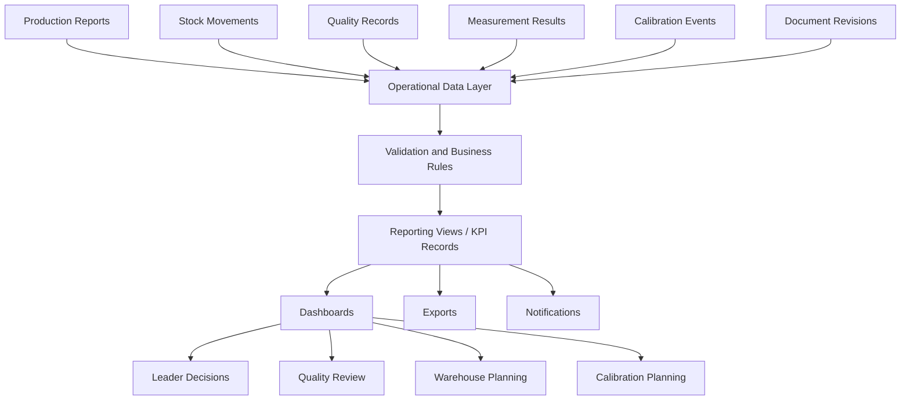

# LightSuite ERP — Reporting Data Flow

## Purpose

This document explains how operational data from production, warehouse, quality, documentation and calibration can become useful reporting information.

The goal is not to create dashboards for decoration. The goal is to show how LightSuite ERP can help leaders and technical users notice problems earlier, understand process status and make better decisions from connected data.

## Reporting question

> How does raw manufacturing activity become useful information for production control, quality review, warehouse visibility and calibration planning?

## Reporting principle

Reports should answer real operational questions.

A useful dashboard should not only display numbers. It should help someone decide what needs attention.

Examples:

- Which orders are late or at risk?
- Which operations are waiting for material?
- Which quality issues repeat?
- Which tools are close to calibration due date?
- Which warehouse locations contain quarantined or blocked stock?
- Which documents or revisions were used in production and quality records?

## High-level data flow



## Main data sources

| Source | Example data | Reporting value |
|---|---|---|
| ProductionReport | quantity OK, quantity NOK, notes, reported time | Shows progress, output and production problems. |
| Operation | status, planned time, actual time, workstation | Shows bottlenecks and operation performance. |
| ProductionOrder | status, priority, planned dates, completed quantity | Shows order progress and delivery risk. |
| StockMovement | receipt, issue, transfer, correction, return | Shows material flow and stock traceability. |
| StockItem | quantity, location, status, lot number | Shows material availability and blocked stock. |
| QualityRecord | inspection status, result, approval time | Shows quality decision status. |
| MeasurementResult | measured value, result status, tool used | Shows measurement outcomes and possible trends. |
| Nonconformity | severity, disposition, status | Shows repeated quality issues and open problems. |
| MeasurementTool | status, location, calibration due date | Shows tool availability and calibration risk. |
| CalibrationEvent | calibration result, next due date | Shows calibration history and planning needs. |
| DocumentRevision | revision, approval, valid from date | Shows document control and traceability context. |
| AuditLog | sensitive actions, approvals, exports | Shows accountability and system integrity. |

## Reporting areas

### 1. Production reporting

Production reporting should answer:

- Which orders are planned, released, in progress or completed?
- Which operations are active or delayed?
- How much quantity was reported OK and NOK?
- Which workstations are overloaded or blocked?
- Which production issues repeat?

Possible KPIs:

| KPI | Meaning |
|---|---|
| Orders in progress | Number of active production orders. |
| Orders at risk | Orders close to due date but not complete. |
| Quantity OK / NOK | Output split by accepted and rejected quantity. |
| Operation delay | Difference between planned and actual time. |
| Issue count by operation | Repeated production issue visibility. |

### 2. Warehouse reporting

Warehouse reporting should answer:

- Which materials are available?
- Which materials are blocked or quarantined?
- Which production orders are waiting for material?
- Which stock movements happened recently?
- Which locations are used most often?

Possible KPIs:

| KPI | Meaning |
|---|---|
| Available stock count | Number of available stock items. |
| Blocked stock count | Items that cannot be issued to production. |
| Material issue volume | Material issued to production over time. |
| Quarantine stock | Stock waiting for review. |
| Movement corrections | Corrections that may indicate process errors. |

### 3. Quality reporting

Quality reporting should answer:

- Which inspections are open, in review or approved?
- Which products or operations generate the most nonconformities?
- Which characteristics fail most often?
- Which measurement tools are used for which results?
- Which quality records are waiting for approval?

Possible KPIs:

| KPI | Meaning |
|---|---|
| Pass / fail ratio | Basic quality outcome trend. |
| Open quality records | Inspections not yet closed. |
| Nonconformities by severity | Risk visibility. |
| Repeated failed characteristics | Early signal for process or design issue. |
| Approval lead time | Time between record creation and approval. |

### 4. Tooling and calibration reporting

Tooling and calibration reporting should answer:

- Which tools are available, issued, blocked or retired?
- Which tools are due for calibration soon?
- Which tools are overdue?
- Which tools were used in quality records?
- Which calibration events failed?

Possible KPIs:

| KPI | Meaning |
|---|---|
| Tools due soon | Tools approaching calibration due date. |
| Overdue tools | Tools that should not be used without review. |
| Failed calibration count | Calibration risk indicator. |
| Tool issue duration | How long tools remain issued. |
| Tool usage by quality record | Traceability between measurements and tools. |

### 5. Documentation reporting

Documentation reporting should answer:

- Which documents are active, obsolete or archived?
- Which revisions are linked to production orders?
- Which quality records used which document revision?
- Are there products without linked documentation?

Possible KPIs:

| KPI | Meaning |
|---|---|
| Active documents | Current controlled documents. |
| Obsolete documents | Documents that should not be used. |
| Orders without linked documentation | Traceability gap. |
| Revision usage | Which revision was used in production or quality. |

## Reporting views concept

In PostgreSQL, some reporting can be handled with database views or materialized views.

Possible first reporting views:

```text
vw_production_order_status
vw_operation_performance
vw_quality_summary
vw_nonconformity_summary
vw_warehouse_stock_summary
vw_calibration_due_summary
vw_document_revision_usage
```

These views should simplify dashboards without hiding the source data.

## KPI records concept

The `kpi_records` table can store calculated or snapshot values.

This can be useful when:

- dashboard values should be frozen for a reporting period,
- calculations are expensive,
- historical KPI trends are needed,
- reports must show what was known at a given time.

Example KPI records:

| kpi_name | kpi_value | unit |
|---|---:|---|
| open_production_orders | 18 | count |
| quality_fail_rate | 4.2 | percent |
| tools_due_soon | 7 | count |
| blocked_stock_items | 3 | count |

## Notification flow

Some reporting results should create action, not only charts.

Examples:

- tool calibration due soon → notify tooling owner,
- overdue calibration → notify tooling owner and leader,
- blocked material requested for production → notify warehouse and leader,
- quality record waiting too long for approval → notify quality user,
- production order close to due date but not started → notify leader.

## Dashboard users

| User | Dashboard focus |
|---|---|
| Leader / Supervisor | Production progress, delays, assignments, issue count, order risk. |
| Quality User | Inspection status, nonconformities, measurement results, approval queue. |
| Warehouse User | Stock availability, blocked materials, material issues, recent movements. |
| Tooling / Calibration Owner | Tool status, due dates, overdue tools, issue history. |
| Analyst | KPI trends, exports, process performance and repeated problems. |
| Administrator | Audit logs, license status, user and system health. |

## Data quality rules

Reporting is only useful if the source data is reliable.

Important rules:

- production reports should require operation context,
- stock movements should always store quantity and movement type,
- quality records should reference production context,
- measurement results should reference inspection characteristics,
- tool-related measurements should reference measurement tools,
- document links should use specific document revisions, not only document titles,
- sensitive changes should create audit logs.

## First MVP dashboard set

Recommended first dashboards:

1. Leader dashboard
2. Quality dashboard
3. Warehouse dashboard
4. Calibration dashboard

### Leader dashboard

Should show:

- active production orders,
- orders at risk,
- active operations,
- production issue count,
- quantity OK / NOK,
- quality records waiting for decision.

### Quality dashboard

Should show:

- open quality records,
- failed inspections,
- nonconformities by severity,
- repeated failed characteristics,
- approval queue.

### Warehouse dashboard

Should show:

- available stock,
- blocked or quarantined stock,
- recent material issues,
- production orders waiting for material.

### Calibration dashboard

Should show:

- tools due soon,
- overdue tools,
- issued tools,
- failed calibration events,
- tools blocked from use.

## Why this reporting layer matters

Reporting is where the system becomes useful for decisions.

Without reporting, users only enter data. With a good reporting flow, the system helps people see risk, delay, missing information and repeated problems.

For LightSuite ERP, this is important because the project is about connecting manufacturing reality with software structure. The reporting layer shows how that connection becomes visible.
