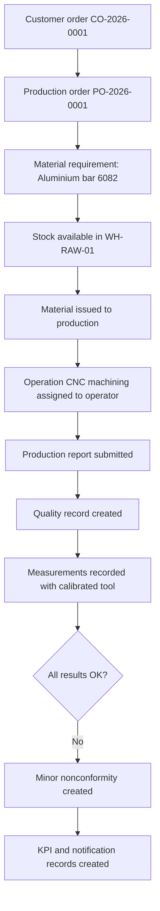

# LightSuite ERP — Sample Demo Data

## Purpose

This document describes the first demo scenario for LightSuite ERP.

The goal is to make the case study easier to understand by showing one realistic manufacturing story that touches production, warehouse, quality, tooling, calibration, documentation, reporting and audit traceability.

The matching SQL seed draft is available in:

```text
sample-demo-data-v0.1.sql
```

## Demo scenario summary

A customer places an order for a precision-machined aluminium bracket.

The order creates a production order. Material is available in the warehouse, issued to production, processed at a machining workstation, inspected by quality, measured with a calibrated tool and then reported into the first KPI records.

The scenario also includes a small quality issue so the system can demonstrate nonconformity handling.

## Scenario name

```text
Demo Scenario 001 — Aluminium Bracket Production Flow
```

## What this scenario demonstrates

This demo shows how LightSuite ERP connects:

- customer order,
- production order,
- product and material master data,
- warehouse location,
- stock item,
- material issue to production,
- workstation and operation,
- operator assignment,
- production report,
- controlled drawing revision,
- measurement tool,
- calibration event,
- quality record,
- inspection characteristics,
- measurement results,
- nonconformity,
- KPI records,
- notification,
- audit log.

## Demo actors

| User | Role | Purpose in scenario |
|---|---|---|
| Alice Admin | Administrator | System setup and access control. |
| Leon Leader | Leader | Releases production order and assigns work. |
| Olivia Operator | Operator | Performs operation and reports production result. |
| Walter Warehouse | Warehouse User | Receives and issues material. |
| Quinn Quality | Quality User | Creates inspection record and records measurements. |
| Theo Tooling | Tooling / Calibration Owner | Maintains measurement tool and calibration data. |
| Anna Analyst | Analyst | Reviews KPI records and reporting data. |

## Demo business objects

| Object | Example |
|---|---|
| Customer | Demo Automotive Customer |
| Supplier | Demo Metals Supplier |
| Product | Aluminium Mounting Bracket |
| Material | Aluminium bar 6082 |
| Customer order | CO-2026-0001 |
| Production order | PO-2026-0001 |
| Workstation | CNC-01 |
| Warehouse location | WH-RAW-01 |
| Production buffer | PROD-BUF-01 |
| Tool room | TOOL-ROOM-01 |
| Measurement tool | Digital Caliper 150 mm |
| Controlled document | Drawing DRW-BRACKET-001, revision A |

## Story flow



## Data consistency goal

The demo data is intentionally small. It should be readable and easy to trace.

It does not try to simulate a full factory. It creates one connected chain that can be followed from customer order to production, inspection, tool usage and reporting.

## Important assumptions

- Password hashes in the seed file are fake placeholders.
- UUIDs are deterministic to make the scenario easier to inspect.
- The scenario assumes `schema-v0.1.sql` has already been applied.
- Quantities and KPI values are illustrative.
- The data is for portfolio and system-design demonstration, not for production use.

## Why this step matters

Sample data turns the architecture into something concrete.

A recruiter, technical reviewer or future collaborator can now see not only the proposed tables and endpoints, but also how real objects would connect in a manufacturing scenario.
