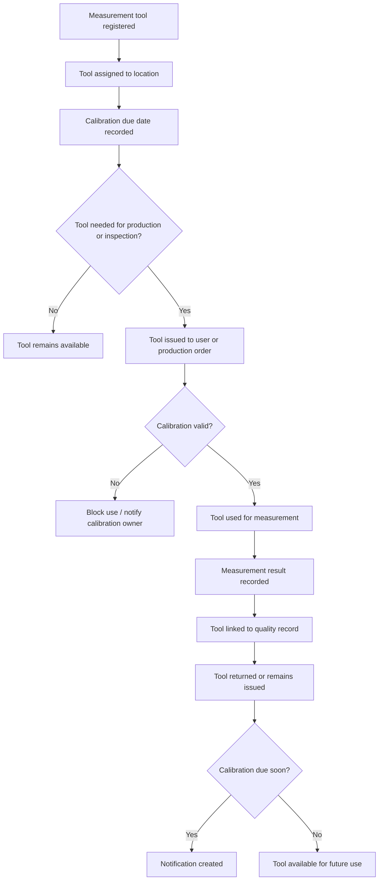

# LightSuite ERP — Tooling and Calibration Workflow

## Purpose

This workflow describes how measurement tools are registered, issued, used and controlled through calibration status.

The goal is to show that measurement tools are not only assets. In manufacturing and quality, they directly affect confidence in inspection results.

## Workflow question

> How does the system make sure that a measurement result is connected to a valid tool, current calibration status and responsible user?

## Actors involved

| Actor | Responsibility |
|---|---|
| Tooling / Calibration Owner | Maintains tool records, locations, issue history and calibration dates. |
| Quality User | Uses measurement tools for inspection and records measurement results. |
| Operator | May receive tools for production use or checks. |
| Leader / Supervisor | Monitors tool availability for production needs. |
| Administrator | Manages permissions and configuration. |

## High-level flow

## Step-by-step workflow

### 1. Measurement tool is registered

A tooling or calibration owner creates a tool record.

The record should include:

- tool code,
- QR code if used,
- tool name,
- tool type,
- current location,
- status,
- calibration due date.

### 2. Tool is assigned to a location

A tool should have a known location.

Possible locations:

- tool room,
- quality lab,
- production buffer,
- workstation,
- quarantine or blocked area.

Location matters because users need to find tools quickly and know whether they are available.

### 3. Calibration data is recorded

A calibration event stores:

- calibration date,
- next due date,
- result,
- certificate reference,
- performer or provider.

This creates history, not only current status.

### 4. Tool is issued

A tool can be issued to:

- operator,
- quality user,
- production order,
- workstation or area.

The system should record who received it, when it was issued and whether it was returned.

### 5. Calibration validity is checked before use

Before a tool is used for measurement, the system should check:

- tool status is available or issued,
- tool is not blocked,
- tool is not retired,
- calibration due date has not passed,
- latest calibration result is acceptable.

If the tool is invalid, the measurement should be blocked or clearly flagged depending on business rule.

### 6. Tool is used for measurement

When a quality user records measurement results, the measurement result should reference the tool.

This connects the inspection result with measurement traceability.

### 7. Tool is returned or remains issued

After use, the tool may be returned to the tool room or remain issued if production still needs it.

The issue history should show current ownership or location.

### 8. Calibration notification is created

The system should warn responsible users before calibration expires.

Possible notification timing:

- 30 days before due date,
- 14 days before due date,
- 7 days before due date,
- overdue.

## Key data created

| Step | Data created or updated |
|---|---|
| Registration | MeasurementTool |
| Calibration | CalibrationEvent |
| Issue | ToolIssue |
| Measurement | MeasurementResult linked to MeasurementTool |
| Due warning | Notification |
| Sensitive update | AuditLog |

## Validation rules

- Tool code must be unique.
- QR code should be unique if used.
- Calibration next due date must not be earlier than calibration date.
- Blocked or retired tools should not be issued.
- Overdue tools should not be used for approved measurements without special permission.
- Updating calibration data should require tooling or administrator permission.
- Calibration update should create an audit log entry.

## Calibration status logic

Suggested status interpretation:

| Condition | Suggested status |
|---|---|
| Tool active and calibration valid | Available |
| Tool currently issued | Issued |
| Due date close | Calibration due |
| Due date passed | Blocked or calibration due, depending on policy |
| Failed calibration | Blocked |
| Removed from use | Retired |

## Why this workflow matters

Measurement results are only as trustworthy as the measurement system behind them.

If the system records a dimension but cannot show which tool was used, whether the tool was valid and who performed the measurement, traceability is weak.

LightSuite ERP should help answer:

- which tool was used,
- who used it,
- when it was used,
- whether it was calibrated,
- when calibration expires,
- whether the result can be trusted.

This is where metrology becomes part of the ERP workflow instead of being a separate spreadsheet or paper record.
