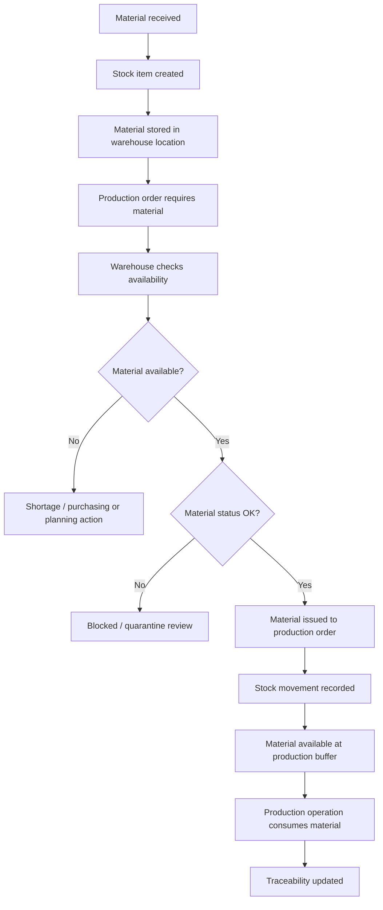

# LightSuite ERP — Warehouse to Production Workflow

## Purpose

This workflow describes how material moves from warehouse stock into production and how that movement becomes traceable.

The goal is to show that warehouse activity is not only inventory control. In manufacturing, material movement is part of the production story and should stay connected with orders, locations, lots and users.

## Workflow question

> How does the system make sure that the right material, from the right location, is issued to the right production order and remains traceable later?

## Actors involved

| Actor | Responsibility |
|---|---|
| Warehouse User | Receives material, manages stock locations and issues material to production. |
| Leader / Supervisor | Reviews production material needs and can request or approve issue to production. |
| Operator | Uses issued material in production. |
| Quality User | May review quarantined or blocked material status. |
| Administrator | Manages master data and permissions. |

## High-level flow

## Step-by-step workflow

### 1. Material is received

A warehouse user receives material from supplier, internal transfer or correction.

The system should capture:

- material reference,
- quantity,
- unit,
- lot or batch number,
- receiving location,
- supplier reference if available,
- created by user,
- timestamp.

### 2. Stock item is created or updated

The received material becomes a stock item in a defined warehouse location.

This creates visibility for planning and production.

### 3. Material is stored in a location

Warehouse locations should support QR codes or location codes.

This helps users avoid ambiguity such as “material is somewhere in warehouse”.

A useful location record should answer:

- where is it,
- what type of area is it,
- can it be scanned,
- is it warehouse, quarantine, production buffer or tool room.

### 4. Production order needs material

A production order is connected to product and material requirements.

The system should allow leader or warehouse user to see which materials are required before work begins.

### 5. Warehouse checks availability

The warehouse user checks whether stock is available in sufficient quantity.

The system should consider:

- stock quantity,
- material status,
- location,
- lot number,
- reservations if supported later,
- quarantine or blocked status.

### 6. Material is issued to production

When material is available and valid, it can be issued to a production order.

This action should create a stock movement of type `issue` and link it to the production order.

### 7. Stock movement is recorded

A stock movement should preserve:

- source stock item,
- production order,
- quantity,
- movement type,
- source location,
- target location if applicable,
- user who created the movement,
- timestamp.

### 8. Material reaches production buffer

In a simple MVP, issuing material may only reduce warehouse stock and link the material to the production order.

In a stronger version, it can also move material to a production buffer location.

### 9. Production consumes material

Production uses material during operations.

The system does not need to overcomplicate consumption at the first stage, but it should keep a traceable connection between material issue and production order.

## Key data created

| Step | Data created or updated |
|---|---|
| Receipt | StockItem, StockMovement |
| Storage | WarehouseLocation link |
| Requirement | ProductMaterialRequirement |
| Issue to production | StockMovement linked to ProductionOrder |
| Production usage | ProductionOrder traceability context |
| Block or quarantine | StockItem status update, AuditLog if sensitive |

## Validation rules

- Material must exist before stock can be received.
- Quantity must be greater than zero.
- Source location must exist for issue or transfer.
- Stock item must have enough quantity before issue.
- Quarantined or blocked material should not be issued without special permission.
- Production order must exist and should be released or in progress before issue.
- Every issue to production should create traceability to production order.

## EAN and QR support

EAN and QR codes can make warehouse work faster and less error-prone.

Possible scanning points:

- scan material code during receipt,
- scan warehouse location,
- scan stock item label,
- scan production order label,
- scan production buffer location.

The key rule is that scanning should not be a decorative feature. It should reduce manual search and reduce wrong material movement.

## Why this workflow matters

This workflow matters because material traceability is one of the foundations of manufacturing control.

When a quality issue appears later, the system should help answer:

- which material was used,
- from which location it came,
- which lot or batch it belonged to,
- who issued it,
- when it was issued,
- which production order consumed it.

That is why warehouse data must stay connected with production data.
